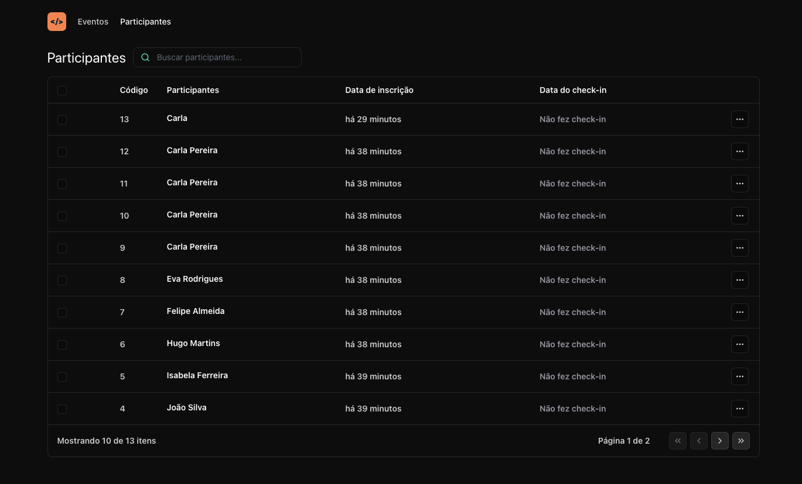

<div align="center">
    <h1 align="center">pass.in-web</h1>
    <p>O pass.in-web é o cliente web da API pass.in-api é uma aplicação de gestão de participantes em eventos presenciais sendo o. A ferramenta permite que o organizador cadastre um evento e abra uma página pública de inscrição. Os participantes inscritos podem emitir uma credencial para check-in no dia do evento.</p>
    
</div>

# 📒 Índice
* [Descrição](#descrição)
* [Requisitos Funcionais](#requisitos)
  * [Features](#features)
* [Tecnologias](#tecnologias)
* [Design](#design)
  * [Cores](#cores)
  * [Fontes](#fontes)
  * [Ícones](#ícones)
* [Instalação](#instalação)
* [Licença](#licença)

# 📃 <span id="descrição">Descrição</span>
O pass.in Web é o cliente web da API pass.in-api é uma aplicação de gestão de participantes em eventos presenciais sendo o. A ferramenta permite que o organizador cadastre um evento e abra uma página pública de inscrição. Os participantes inscritos podem emitir uma credencial para check-in no dia do evento. Desenvolvida utilizando superset [**TypeScript**](https://www.typescriptlang.org/), com a biblioteca [**React**](https://react.dev/) para web, [**Vite**](https://vitejs.dev/) para o desenvolvimento e o framework CSS [**tailwindcss**](https://tailwindcss.com/) para um layout responsivo e padronizado.

# 📌 <span id="requisitos">Requisitos Funcionais</span>
- [x] O organizador deve poder visualizar dados de um evento<br>
- [x] O organizador deve poder visualizar a lista de participantes<br>

## Features
- [x] Buscar participante por nome<br>
- [x] Requisição a API<br>
- [x] Responsividade<br>

# 💻 <span id="tecnologias">Tecnologias</span>
- **HTML**
- **CSS**
- **JavaScript**
- **TypeScript**
- **Vite**
- **ReactJS**
- **axios**
- **tailwindcss**
- **tailwind-merge**
- **dayjs**
- **lucide-react**

# 🎨 <span id="design">Design</span>
- O modelo final para versão desktop e mobile está disponível na pasta `./design`

- <span id="cores">Cores<br></span>
  * #09090B<br>
  * #A3E635<br>
  * #A1A1A6<br>
  * #FAFAFA<br>

- <span id="fontes">Fontes<br></span>
  * Arial, Segoe UI, sans-serif

- <span id="ícones">Ícones<br></span>
  * Lucide React

# 🚀 <span id="instalação">Instalação</span>
```bash
  # Clone este repositório:
  $ git clone https://github.com/CleilsonAndrade/pass.in-web.git
  $ cd ./pass.in-web

  # Instalar as dependências:
  $ yarn install

  # Executar:
  $ yarn dev
```

# 📝 <span id="licença">Licença</span>
Esse projeto está sob a licença MIT. Veja o arquivo [LICENSE](LICENSE) para mais detalhes.

---

<p align="center">
  Feito com 💜 by CleilsonAndrade
</p>
